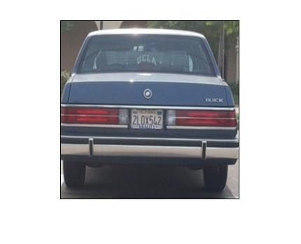
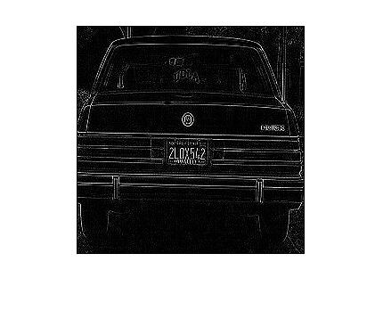
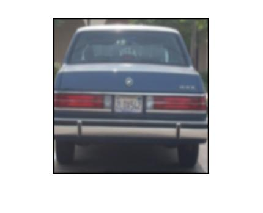
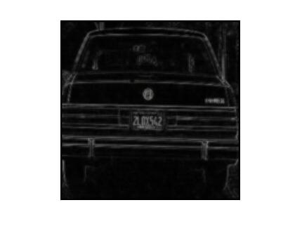
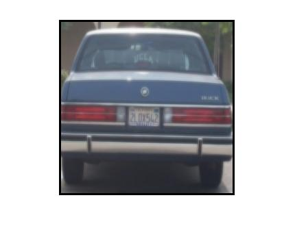
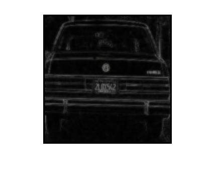
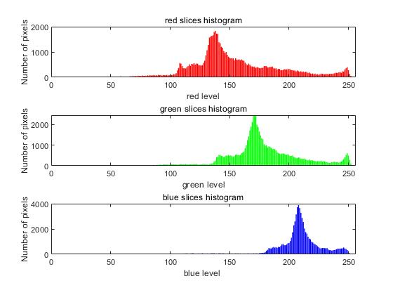
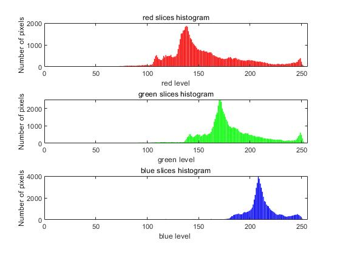

# Each function

----
#### ICV_Rot
##### Required input
 - First argument: an image.
 - second argument: an angle.

##### Return
 - after rotated image.

##### Example:

```
img = imread("car-1.jpg");
rotate_30 = ICV_Rot(img,30);
```
##### After rotated image:


---
#### ICV_shew
##### Required input
 - First argument: an image.
 - second argument: an angle.

##### Return
 - after skewed image.

##### Example:

```MATLAB
img = imread("car-1.jpg");
shew_10 = ICV_Shew(img,10);
```


---
#### ICV_filter
##### Required input
 - First argument: an image.

##### Return
 - after filtered image.

##### Kernal:
```
kernel  = [1,2,1
           2,4,2
           1,2,1];
```

##### Example:

```
img = imread("car-1.jpg");
filter_some = ICV_filter(img);
imshow(filter_some);
```

##### After filter image:


---
#### ICV_filterB
##### Required input
 - First argument: an image.

##### Return
 - after filtered image.

##### Kernal:
```
kernel   =     [0,1,0
                1,-4,1
                0,1,0];
```

##### Example:

```
img = imread("car-1.jpg");
filter_some = ICV_filterB(img);
imshow(filter_some);
```
##### After filter image:



---
#### ICV_filter55
##### Required input
 - First argument: an image.

##### Return
 - after filtered image.

##### Kernal:
```
kernel   =     [1,1,2,1,1
                1,2,4,2,1
                2,4,8,4,2
                1,2,4,2,1
                1,1,2,1,1];
```

##### Example:

```
img = imread("car-1.jpg");
filter_some = ICV_filter55(img);
imshow(filter_some);
```
##### After filter image:


---
#### ICV_filter55B
##### Required input
 - First argument: an image.

##### Return
 - after filtered image.

##### Kernal:
```
kernel   =     [0,0,0,0,0
                0,0,1,0,0
                0,1,-4,1,0
                0,0,1,0,0
                0,0,0,0,0];
```

##### Example:

```
img = imread("car-1.jpg");
filter_some = ICV_filter55B(img);
imshow(filter_some);
```
##### After filter image:


---
#### ICV_filter77
##### Required input
 - First argument: an image.

##### Return
 - after filtered image.

##### Kernal:
```
kernel   =  [1,1,1,2,1,1,1
             1,1,2,4,2,1,1
             1,2,4,8,4,2,1
             2,4,8,16,8,4,2
             1,2,4,8,4,2,1
             1,1,2,4,2,1,1
             1,1,1,2,1,1,1];
```

##### Example:

```
img = imread("car-1.jpg");
filter_some = ICV_filter77(img);
imshow(filter_some);
```

##### After filter image:



---
#### ICV_filter77B
##### Required input
 - First argument: an image.

##### Return
 - after filtered image.

##### Kernal:
```
kernelB           = [0,0,0,0,0,0,0
                     0,0,0,0,0,0,0
                     0,0,0,1,0,0,0
                     0,0,1,-4,1,0,0
                     0,0,0,1,0,0,0
                     0,0,0,0,0,0,0
                     0,0,0,0,0,0,0];
```

##### Example:

```
img = imread("car-1.jpg");
filter_some = ICV_filter77B(img);
imshow(filter_some);
```
##### After filter image:

---
#### ICV_histogram
##### Required input
 - First argument: an image.

##### functon output
This function will output three hisgram corresponding to the pixels on the image RGB level.


##### Example:

```
video = "DatasetB.avi";
obj = VideoReader(video);
img = read(obj,299);
ICV_histogram(img);
```

##### Hisgram image:


---
#### ICV_compareTwoframe
##### Required input
 - First argument: an image.
 - Second argument: an image.

##### functon output
This function will output the intersection corresponding with the pixels on the two image RGB level.


##### Example:

```
video = "DatasetB.avi";
obj = VideoReader(video);
img1 = read(obj,3);
img2 = read(obj,4);
ICV_compareTwoframe(img1,img2);
```
##### Hisgram image:


---
#### ICV_compareTwoframe2
##### Required input
 - First argument: an image.
 - Second argument: an image.

##### functon output
This function will output the union corresponding with the pixels on the two image RGB level.


##### Example:

```
video = "DatasetB.avi";
obj = VideoReader(video);
img1 = read(obj,3);
img2 = read(obj,4);
ICV_compareTwoframe2(img1,img2);
```
---
#### ICV_compareTwoframe2
##### Required input
 - First argument: an image.
 - Second argument: an image.

##### functon output
This function will output the union corresponding with the pixels on the two image RGB level.


##### Example:

```
video = "DatasetB.avi";
obj = VideoReader(video);
img1 = read(obj,3);
img2 = read(obj,4);
ICV_compareTwoframe2(img1,img2);
```

---
#### ICV_intersection
##### Required input
 - First argument: an array.
 - Second argument: an array.

##### Return
 - An array

##### Function doing
 - calculate intersection of a pair of array

##### Example:

```
red_his_i = ICV_intersection(red_his, red_his2);
```
---
#### ICV_join
##### Required input
 - First argument: an array.
 - Second argument: an array.

##### Return
 - An array

##### Function doing
 - calculate union of a pair of array

##### Example:

```
red_his_i = ICV_join(red_his, red_his2);
```
